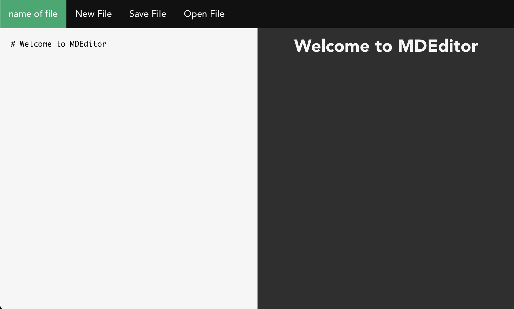

# Markdown Editor application made with Tauri



### Features

- **Markdown Editing**: A simple yet powerful Markdown editor for creating and editing Markdown documents.
- **Cross-Platform**: Build and run on Windows, macOS, and Linux.
- **Native Performance**: Utilizes Tauri to deliver a native desktop application experience.

## Getting Started

### Prerequisites

Before you begin, make sure you have the following installed:

- [Node.js](https://nodejs.org/)
- [Rust](https://www.rust-lang.org/)

### Installation

1. Clone this repository:

    ```bash
    git clone https://github.com/your-username/tauri-vue-vite-markdown-editor.git
    ```

2. Navigate to the project directory:

    ```bash
    cd tauri-vue-vite-markdown-editor
    ```

3. Install dependencies:

    ```bash
    npm install
    ```

4. Build the application:

    ```bash
    npm run build
    ```

5. Run the application:

    ```bash
    npm run tauri dev
    ```

### Usage

- Open the application and start writing Markdown content.
- Use the toolbar for common Markdown actions.
- Save your document or export it in various formats.
